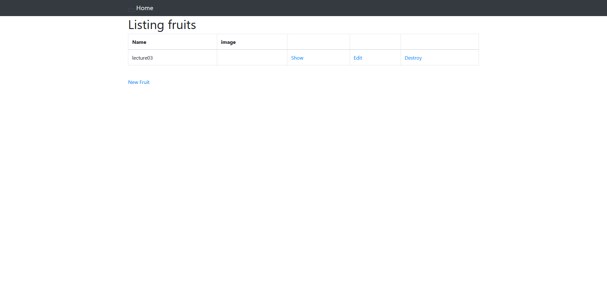

# サンプルアプリケーションの実行
 
# 第三回課題
## APサーバーについて
Web3層構造と呼ばれるWebシステムの中間に位置するプログラムを動作させるサーバーのこと。
WEBサーバー、APサーバー、DBサーバーの3つで構成される。

ユーザーのHTTPリクエストを**WEBサーバー**が受け取り、次にWEBサーバーからの要求を受けて**APサーバー**が
プログラミング言語による処理を行う。その後、**DBサーバー**に対してデータ処理を要求する。
### 今回実行したアプリケーションのAPサーバーの名前とバージョン
puma version 5.6.5
### AP サーバーを終了させた場合、引き続きアクセスできるか。
アクセスできない（application seems to be running here!）
## DB サーバーについて
システムが取り扱うデータを一元管理し、APサーバーからの要求に基づいてデータの保存や更新などを行う
データベースを構築するために運用・管理を行うシステム
### サンプルアプリケーションで使ったDB サーバーの名前と、今回Cloud9で動作しているバージョン
mysql  Ver 8.0.34 for Linux on x86_64 (MySQL Community Server - GPL)
### DB サーバーを終了させた場合、引き続きアクセスできますか？
アクセスできない（Can't connect to local MySQL server through socket '/var/lib/mysql/mysql.sock'）
## Rails の構成管理ツールの名前は何でしたか？確認してみてください。
**Bundler**を利用して、Gemと呼ばれる外部ライブラリをまとめてインストールできる。
## 今回の課題から学んだことを報告してください。
DBサーバーのソケットファイルのパスやyarnの導入・バージョンの違いなど環境構築の複雑さを感じましたが、
同時にエラー内容を1文ずつ丁寧に確認していくことの重要さも学ぶことができました。
## 発生したエラー
Cloud9の起動遅延 → インスタンスの停止&開始で解決
>This is taking longer than expected. The delay may be caused by high CPU usage in your environment, or your T2 or T3 instance is running out of burstable CPU capacity credits, or there are VPC configuration issues. Please check documentation.
>>

プレビュー画面と接続できていない → ブラウザのクッキー設定を見直して解決
>VFS connection does not exist
 
